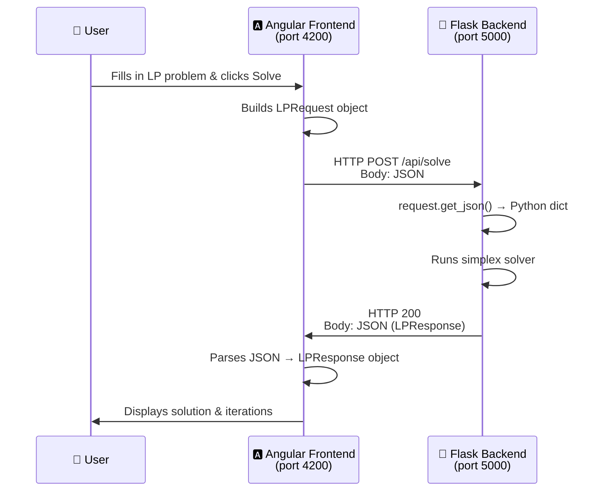

# Flask ↔ Angular Communication Explained

## The Big Picture



---

## 1. What Angular SENDS to Flask

When the user clicks **Solve**, Angular sends a `POST` request with this JSON body:

```json
{
  "objective": "max",
  "coefficients": [5, 4],
  "constraints": [
    { "coefficients": [6, 4], "operator": "<=", "rhs": 24 },
    { "coefficients": [1, 2], "operator": "<=", "rhs": 6  }
  ],
  "variableNames": ["x1", "x2"]
}
```

This is defined by your `LPRequest` interface in [lp.models.ts](file:///d:/2nd%20year%202nd%20term/OR/SimplexMethod/front/src/app/models/lp.models.ts#L35-L40).

| Field | Type | Meaning |
|-------|------|---------|
| `objective` | `"max"` or `"min"` | Maximize or minimize |
| `coefficients` | `number[]` | Objective function coefficients (e.g. 5x₁ + 4x₂) |
| `constraints` | `Constraint[]` | Each row: coefficients + operator + RHS |
| `variableNames` | `string[]` | Labels like `["x1", "x2"]` |

---

## 2. What Flask Should SEND BACK

Flask needs to respond with JSON matching your `LPResponse` interface in [lp.models.ts](file:///d:/2nd%20year%202nd%20term/OR/SimplexMethod/front/src/app/models/lp.models.ts#L59-L65):

### ✅ Success Response
```json
{
  "status": "optimal",
  "optimalValue": 21.0,
  "variables": {
    "x1": 3.0,
    "x2": 1.5
  },
  "iterations": [
    {
      "iterationNumber": 0,
      "basisVariables": ["s1", "s2"],
      "tableau": [
        [6, 4, 1, 0, 0, 24],
        [1, 2, 0, 1, 0, 6],
        [-5, -4, 0, 0, 1, 0]
      ],
      "pivotRow": 0,
      "pivotColumn": 0,
      "objectiveValue": 0
    },
    {
      "iterationNumber": 1,
      "basisVariables": ["x1", "s2"],
      "tableau": [
        [1, 0.667, 0.167, 0, 0, 4],
        [0, 1.333, -0.167, 1, 0, 2],
        [0, -0.667, 0.833, 0, 1, 20]
      ],
      "pivotRow": 1,
      "pivotColumn": 1,
      "objectiveValue": 20
    },
    {
      "iterationNumber": 2,
      "basisVariables": ["x1", "x2"],
      "tableau": [
        [1, 0, 0.25, -0.5, 0, 3],
        [0, 1, -0.125, 0.75, 0, 1.5],
        [0, 0, 0.75, 0.5, 1, 21]
      ],
      "objectiveValue": 21
    }
  ],
  "message": "Optimal solution found"
}
```

### ❌ Error / Special Responses
```json
{ "status": "infeasible", "message": "No feasible solution exists" }
```
```json
{ "status": "unbounded", "message": "The problem is unbounded" }
```
```json
{ "status": "error", "message": "Invalid input: coefficients cannot be empty" }
```

---

## 3. How Flask RECEIVES the Request

Flask uses `request.get_json()` to parse the incoming JSON body into a **Python dictionary**:

```python
from flask import Flask, request, jsonify
from flask_cors import CORS

app = Flask(__name__)
CORS(app)  # ← CRITICAL! Without this, Angular can't talk to Flask

@app.route('/api/solve', methods=['POST'])
def solve():
    # ┌─────────────────────────────────────────────────────┐
    # │  STEP 1: RECEIVE — Get the JSON from Angular        │
    # └─────────────────────────────────────────────────────┘
    data = request.get_json()
    
    # data is now a plain Python dict:
    # {
    #   "objective": "max",
    #   "coefficients": [5, 4],
    #   "constraints": [
    #     {"coefficients": [6, 4], "operator": "<=", "rhs": 24},
    #     ...
    #   ],
    #   "variableNames": ["x1", "x2"]
    # }
    
    # Access fields like any dict:
    objective      = data['objective']       # "max"
    obj_coeffs     = data['coefficients']    # [5, 4]
    constraints    = data['constraints']     # list of dicts
    variable_names = data['variableNames']   # ["x1", "x2"]
    
    # Loop through constraints:
    for c in constraints:
        coeffs   = c['coefficients']  # [6, 4]
        operator = c['operator']      # "<="
        rhs      = c['rhs']           # 24
```

> [!IMPORTANT]
> **`request.get_json()`** is the KEY function. It:
> 1. Reads the raw HTTP body (a JSON string)
> 2. Calls `json.loads()` internally
> 3. Returns a Python `dict` (or `list`)
> 
> It only works when the request has `Content-Type: application/json` — which Angular's HttpClient sets automatically.

---

## 4. How Flask SENDS the Response

Flask uses `jsonify()` to convert a Python dict back into a JSON HTTP response:

```python
    # ┌─────────────────────────────────────────────────────┐
    # │  STEP 2: PROCESS — Run your simplex solver          │
    # └─────────────────────────────────────────────────────┘
    # ... call your solver here ...
    # result = simplex_solve(objective, obj_coeffs, constraints, ...)
    
    # ┌─────────────────────────────────────────────────────┐
    # │  STEP 3: SEND — Return JSON to Angular              │
    # └─────────────────────────────────────────────────────┘
    return jsonify({
        "status": "optimal",
        "optimalValue": 21.0,
        "variables": {"x1": 3.0, "x2": 1.5},
        "iterations": [
            {
                "iterationNumber": 0,
                "basisVariables": ["s1", "s2"],
                "tableau": [[6,4,1,0,0,24], [1,2,0,1,0,6], [-5,-4,0,0,1,0]],
                "pivotRow": 0,
                "pivotColumn": 0,
                "objectiveValue": 0
            }
            # ... more iterations ...
        ],
        "message": "Optimal solution found"
    })
```

> [!IMPORTANT]
> **`jsonify()`** does the opposite of `get_json()`:
> 1. Takes a Python `dict`
> 2. Calls `json.dumps()` internally
> 3. Sets `Content-Type: application/json` on the response
> 4. Returns a proper Flask `Response` object

---

## 5. The Full Lifecycle — Step by Step

```
   ANGULAR (Browser)                              FLASK (Server)
   ═══════════════════                             ════════════════

1. User clicks "Solve"
       │
2. Component calls:
   simplexService.solve(request)
       │
3. Service runs:                    ──── HTTP POST ────►
   http.post<LPResponse>(                              4. Flask route receives it:
     'http://localhost:5000/api/solve',                    @app.route('/api/solve')
     request  ← JS object                                def solve():
   )                                                          data = request.get_json()
       │                                                      ← now a Python dict
   HttpClient auto-does:
   • JSON.stringify(request)                           5. Solver processes the data
   • Sets Content-Type: application/json                  result = solve_lp(data)
   • Sends as HTTP POST body
                                                       6. Flask sends back:
                                    ◄── HTTP 200 ──────    return jsonify(result)
                                                           ← Python dict → JSON
7. HttpClient auto-does:
   • JSON.parse(response body)
   • Returns it as LPResponse type
       │
8. .subscribe({ next: (response) => ...})
   • result.set(response)
       │
9. Template reads result()
   → UI updates automatically
```

---

## 6. CORS — Why You Need It

Angular runs on `http://localhost:4200`, Flask on `http://localhost:5000`. Browsers **block** requests across different origins by default (security).

```python
from flask_cors import CORS

app = Flask(__name__)
CORS(app)  # Tells Flask: "Allow requests from any origin"
```

Without `CORS(app)`, you'd see this error in the browser console:
```
Access to XMLHttpRequest at 'http://localhost:5000/api/solve'
from origin 'http://localhost:4200' has been blocked by CORS policy
```

> [!TIP]
> Install it with: `pip install flask-cors`

---

## 7. Error Handling in Flask

Always handle errors gracefully so Angular can display useful messages:

```python
@app.route('/api/solve', methods=['POST'])
def solve():
    try:
        data = request.get_json()
        
        # Validate input
        if not data:
            return jsonify({"status": "error", "message": "No JSON body provided"}), 400
        
        if 'coefficients' not in data:
            return jsonify({"status": "error", "message": "Missing coefficients"}), 400
        
        # ... run solver ...
        
        return jsonify({
            "status": "optimal",
            "optimalValue": result_value,
            "variables": result_vars,
            "iterations": result_iterations
        })
    
    except Exception as e:
        return jsonify({"status": "error", "message": str(e)}), 500
```

The second argument (`400`, `500`) is the HTTP status code. This is what Angular checks in the error handler:
- `400` = Bad Request (client's fault — bad input)
- `500` = Server Error (server's fault — bug in solver)

Your Angular service already handles these in [simplex.service.ts](file:///d:/2nd%20year%202nd%20term/OR/SimplexMethod/front/src/app/services/simplex.service.ts#L137-L154).

---

## 8. Summary Cheat Sheet

| Concept | Angular Side | Flask Side |
|---------|-------------|------------|
| **Send data** | `http.post(url, jsObject)` | `data = request.get_json()` |
| **Receive data** | `.subscribe({ next: (resp) => })` | `return jsonify(python_dict)` |
| **Auto JSON serialize** | `HttpClient` does `JSON.stringify()` | `jsonify()` does `json.dumps()` |
| **Auto JSON parse** | `HttpClient` does `JSON.parse()` | `get_json()` does `json.loads()` |
| **Content-Type header** | Set automatically | Set automatically |
| **Cross-origin** | N/A | `CORS(app)` |
| **Error format** | `HttpErrorResponse` | `return jsonify({...}), 400` |

> [!NOTE]
> **Key takeaway:** Both sides handle JSON conversion automatically.
> - Angular: `JS Object` ↔ `JSON string` (via HttpClient)
> - Flask: `Python dict` ↔ `JSON string` (via `get_json()` / `jsonify()`)
> 
> You never manually call `JSON.stringify()` or `json.dumps()` yourself — the frameworks do it for you.
